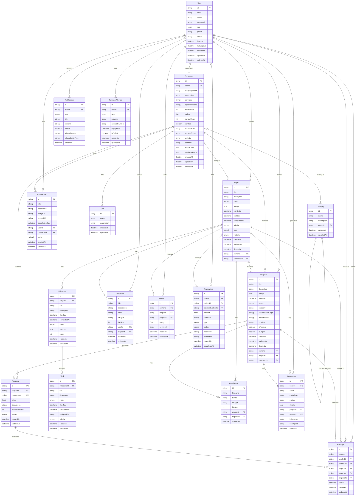

# Диаграмма базы данных

Эта диаграмма показывает основные сущности и связи между ними в базе данных проекта Happyness.

## Диаграмма ER

## Полные связи между сущностями

### Пользователи и аутентификация

- User 1:1 Contractor (один пользователь может иметь один профиль подрядчика)
- User 1:N Project (один пользователь может создать много проектов)
- User 1:N Request (один пользователь может создать много запросов)

### Коммуникации

- User 1:N Message (как отправитель)
- User 1:N Message (как получатель)
- User 1:N Notification (один пользователь может получать много уведомлений)

### Проекты и запросы

- Project N:1 User (проект принадлежит одному пользователю)
- Project N:1 Contractor (проект может выполняться одним подрядчиком)
- Project 1:N Request (проект может содержать много запросов)
- Project 1:N Milestone (проект может содержать много вех)
- Request N:1 User (запрос создается одним пользователем)
- Request N:1 Project (запрос может относиться к одному проекту)
- Request N:1 Contractor (запрос может быть назначен одному подрядчику)
- Request 1:N Proposal (запрос может получить много предложений)

### Документы и файлы

- User 1:N Document (пользователь может загружать много документов)
- Project 1:N Document (проект может содержать много документов)
- Project 1:N Attachment (проект может иметь много вложений)
- Request 1:N Attachment (запрос может иметь много вложений)

### Финансы

- User 1:N PaymentMethod (пользователь может иметь много методов оплаты)
- User 1:N Transaction (пользователь может совершать много транзакций)
- Project 1:N Transaction (проект может иметь много связанных транзакций)
- PaymentMethod 1:N Transaction (методом оплаты можно совершить много транзакций)

### Задачи и вехи

- Milestone N:1 Project (веха относится к одному проекту)
- Task N:1 Milestone (задача относится к одной вехе)

### Прочие связи

- Contractor M:N Skill (подрядчик может иметь много навыков)
- Contractor M:N Category (подрядчик может относиться к нескольким категориям)
- Category 1:N Category (категория может иметь подкатегории)
- User 1:N PortfolioItem (пользователь может иметь много элементов портфолио)
- Contractor 1:N PortfolioItem (подрядчик может иметь много элементов портфолио)
- User 1:N ActivityLog (действия пользователя логируются)
